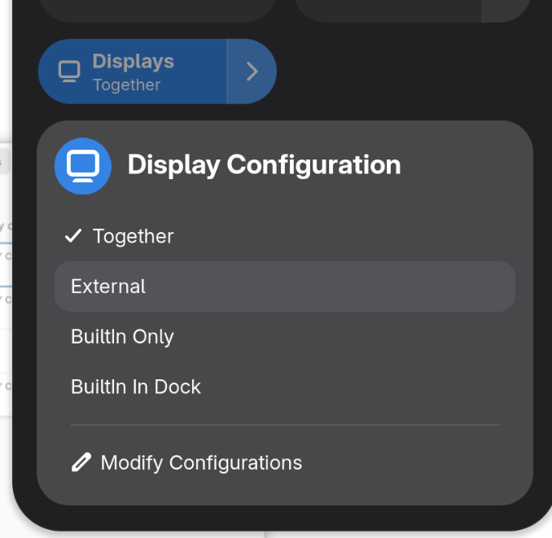
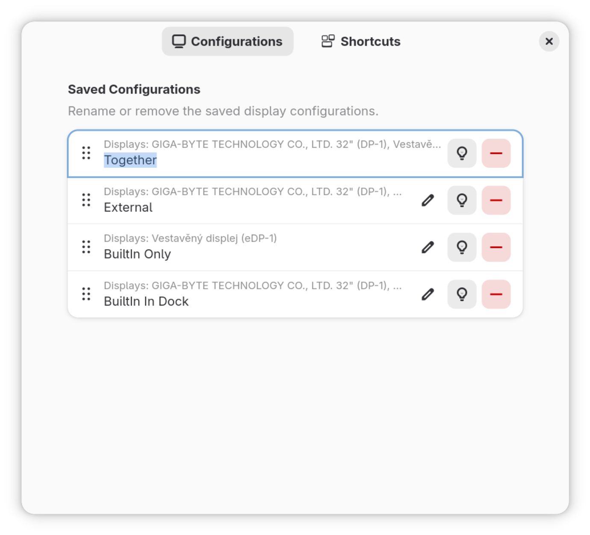

# My-Vision

<div align="center">
    
</div>

**Improved fork of Display Configuration Switcher for GNOME Shell**

> 🌱 **Help Keep This Going**  
> Your support makes a real difference. If you value my work and want to help me continue creating, please consider making a donation.  
> 💙 **Donate here:** [https://paypal.me/TomasMark](https://paypal.me/TomasMark)  
> Every contribution is truly appreciated ✨

## Screenshots

<div align="center">
    
    
</div>

## Description

My Vision allows you to store and quickly switch between multiple display configuration profiles directly from the GNOME system menu. Profiles are bound to specific display devices, eliminating the need for redundant profiles in scenarios where video outputs are detected or ordered unpredictably.

## Features

- 🖥️ Save and restore display configurations with a single click
- ⌨️ Keyboard shortcuts support for fast profile switching
- 🔄 Profiles are bound to physical display names (not port order)
- 📋 Drag & drop reordering of saved configurations
- ⚡ Quick access from the GNOME Quick Settings menu

## Improvements over the original Display Configuration Switcher

- The order of video output connectors does not matter — the target is always identified by the display name
- Fixed various bugs from the original version
- Enhanced preferences UI with drag & drop support

## Compatibility

| GNOME Shell Version |
|:-------------------:|
| 46                  |
| 47                  |
| 48                  |
| 49                  |

## Installation

### From GNOME Extensions (Recommended)

The recommended way to install the extension is via GNOME Extensions website:

👉 https://extensions.gnome.org/extension/9014/my-vision/

### Manual Installation

Alternatively, you can clone this repository and build the extension manually.

#### Requirements

- `blueprint-compiler` - for compiling Blueprint UI files
- `glib-compile-resources` - for compiling GResource files
- `gnome-extensions` - for packaging and installing

#### Build & Install

To build and install the extension, run:

```bash
bash build.sh -bi
```

Available build options:

| Option | Description                            |
|:------:|----------------------------------------|
| `-b`   | Build the extension                    |
| `-i`   | Install the extension                  |
| `-l`   | Log out GNOME session after install    |

Example with automatic logout:

```bash
bash build.sh -bil
```

## Usage

1. After installation, enable the extension via GNOME Extensions app or the website
2. Click on the display icon in Quick Settings panel
3. Save your current display configuration with a custom name
4. Switch between saved configurations with a single click
5. Optionally, set up keyboard shortcuts in extension preferences

## Authors and Acknowledgment

- **Tomáš Mark** — current maintainer ([GitHub](https://github.com/tomasmark79))
- **Christophe Van den Abbeele** — original author

## Contributing

Contributions are welcome! Feel free to open issues or submit pull requests.

## License

This project is licensed under the **GNU General Public License v3.0**.

Copyright © 2024 Tomáš Mark

See [LICENSE](LICENSE) for details.