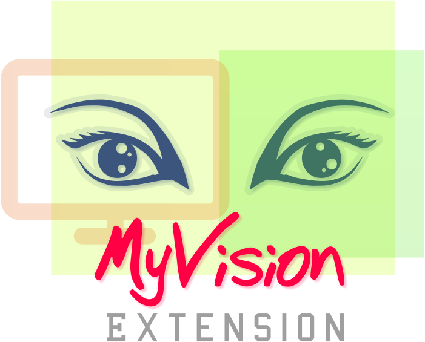

# My-Vision

is improved fork of [Display Configuration Switcher (GNOME Extension)](https://gitlab.com/knokelmaat/display-configuration-switcher-gnome-extension)

<div>
    
</div>

## Description
Quickly change the display configuration from the system menu.

## Impovements over the original extension
- Supports multiple monitors independently on video outputs order
- Fixed couple of bugs in original code
- ...
 
## Installation
To build and install the extension, run:
```bash
bash build.sh -bi
```

It is also possible to add `-l` to immediately logout the GNOME session after this:
```bash
bash build.sh -bil
```

## Support
If you have any problems or requests, please add them to the issue tracker of this repository.

## Contributing
Any and all contributions are welcome! I am not a javascript programmer, so suggestions on style and practices are also welcome.

## Authors and acknowledgment
Tomáš Mark (current maintainer on this repository)
Christophe Van den Abbeele (original author)

## License
GPLv3 - Copyright (C) 2024 Tomáš Mark

## Project status
Alive and kicking.
