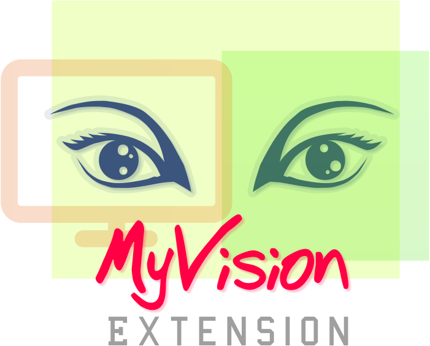
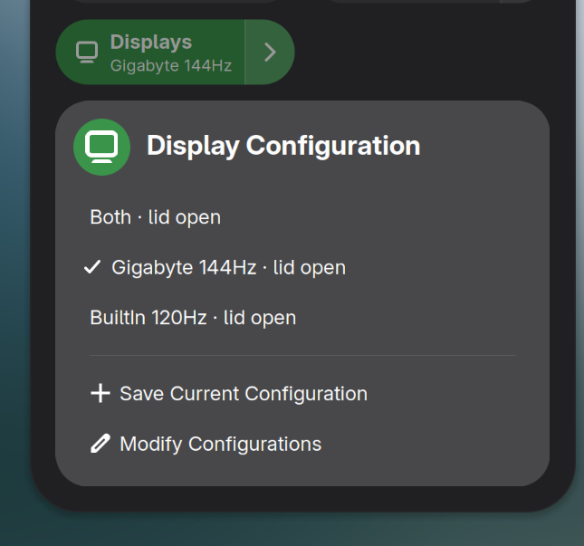
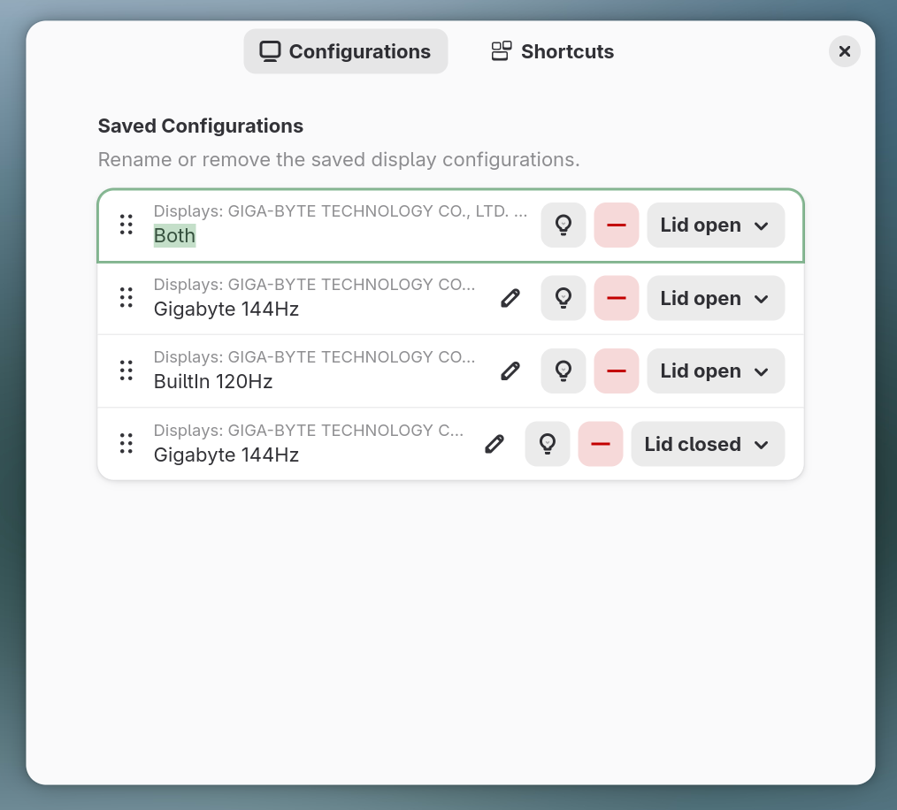

# My-Vision

[](https://paypal.me/TomasMark)

<div align="center">
    
</div>

**Improved fork of Display Configuration Switcher for GNOME Shell**

## Screenshots

<div align="center">
    
    
</div>

## Description

My Vision allows you to store and quickly switch between multiple display configuration profiles directly from the GNOME system menu. Profiles are bound to specific display devices, eliminating the need for redundant profiles in scenarios where video outputs are detected or ordered unpredictably.

## Profile identity and laptop lids

New profiles remember the lid state in which they were saved. Preferences lets you
choose **Lid open**, **Lid closed**, or **Any lid state** for each profile. Profiles
that activate the built-in panel are unavailable with the lid closed. The built-in
panel is identified by Mutter's `is-builtin` property, not a hard-coded port name.

Duplicate detection compares the lid condition, physical monitor identities,
active monitor assignments, resolution/refresh/VRR mode, position, scale, rotation,
primary monitor and all stored properties. Connector renumbering, enumeration
order and dictionary ordering do not create duplicates. Saving an exact duplicate
keeps the existing profile and name. Different refresh rates or lid conditions
remain separate profiles.

Hardware is matched by vendor, product and serial information supplied by Mutter.
Legacy names are upgraded only when there is one unambiguous match. Identical
monitors without distinct identification are refused rather than assigned randomly.
Names from old profiles can still depend on the original desktop language until
upgraded; newly identified hardware does not.

The versioned `profiles-v2` setting stores stable profile IDs, lid conditions and
last selections per connected monitor set and lid state. On first use, existing
profiles are copied with **Any lid state** because their historical lid state is
unknown. The old `configs` and `last-config-index` keys remain untouched as a backup.
Renaming/reordering profiles does not change remembered selections. Deleting a
profile removes references to its ID. Changing a lid condition is refused if it
would introduce an exact duplicate.

## Features

- Save and restore display configurations with a single click
- Keyboard shortcuts support for fast profile switching
- Profiles are bound to physical monitor identities (not port order)
- Drag & drop reordering of saved configurations
- Quick access from the GNOME Quick Settings menu

## Improvements over the original Display Configuration Switcher

- Connector order does not matter; monitor assignment must be unambiguous
- Fixed various bugs from the original version
- Enhanced preferences UI with drag & drop support

## Compatibility

| GNOME Shell Version |
|:-------------------:|
| 46                  |
| 47                  |
| 48                  |
| 49                  |
| 50                  |

## Installation

### From GNOME Extensions (Recommended)

The recommended way to install the extension is via GNOME Extensions website:

👉 https://extensions.gnome.org/extension/9014/my-vision/

### Manual Installation

Alternatively, you can clone this repository and build the extension manually.

#### Requirements

- `blueprint-compiler` - for compiling Blueprint UI files
- `glib-compile-resources` - for compiling GResource files
- `gnome-extensions` - for packaging and installing

#### Build & Install

To build and install the extension, run:

```bash
bash build.sh -bi
```

Available build options:

| Option | Description                            |
|:------:|----------------------------------------|
| `-b`   | Build the extension                    |
| `-i`   | Install the extension                  |
| `-l`   | Log out GNOME session after install    |

Example with automatic logout:

```bash
bash build.sh -bil
```

## Usage

1. After installation, enable the extension via GNOME Extensions app or the website
2. Click on the display icon in Quick Settings panel
3. Save your current display configuration with a custom name
4. Switch between saved configurations with a single click
5. Optionally, set up keyboard shortcuts in extension preferences

## Startup behavior and verification

The last selection for the current monitor set and lid state is restored after
GNOME Shell finishes startup, and after the lid state or connected monitor set
changes. Without a remembered selection, a matching lid-specific profile is
preferred, followed by a usable legacy/shared profile. Display changes are
coalesced for 500 ms. Own mode-setting events do not repeatedly restore a profile.

Before applying, the extension refreshes the lid and monitor state, remaps ports
against that fresh state and verifies the saved mode/scale/color mode. It skips
ApplyMonitorsConfig when the requested settings already hold. A context change
supersedes the old request; transient stale-state retries are bounded. Manual
selections made during an apply are queued, with the latest selection taking priority.
No missing mode is silently replaced with a lower refresh rate. If no profile is
usable, the menu asks you to save one; the extension cannot invent your preferences.

Run regression checks without changing the running desktop:

```bash
glib-compile-schemas --strict schemas
GSETTINGS_BACKEND=memory gjs -m tests/profiles.js
gjs -m tests/display-config.js
gjs -m tests/initialization.js
node --test tests/startup.cjs tests/restore.cjs
```

An optional integration check reads the live lid/monitor state and checks legacy
profiles without applying a configuration or writing settings:

```bash
gjs -m tests/live-read-only.js
```

After installing an update, log out and back in so GNOME Shell loads the new
JavaScript modules and settings schema. Physical checks: save different external
monitor profiles with the lid open/closed; repeat saving to check deduplication;
verify 60 Hz and 144 Hz variants remain distinct; open/close the lid, reconnect the
dock, reorder/rename profiles and confirm the correct selection and refresh rate.
Also test rapid lid changes and disabling the extension during a switch.

## Authors and Acknowledgment

- **Tomáš Mark** — current maintainer ([GitHub](https://github.com/tomasmark79))
- **Christophe Van den Abbeele** — original author

## Contributing

Contributions are welcome! Feel free to open issues or submit pull requests.

## License

This project is licensed under the **GNU General Public License v3.0**.

Copyright © 2024 Tomáš Mark

See [LICENSE](LICENSE) for details.
