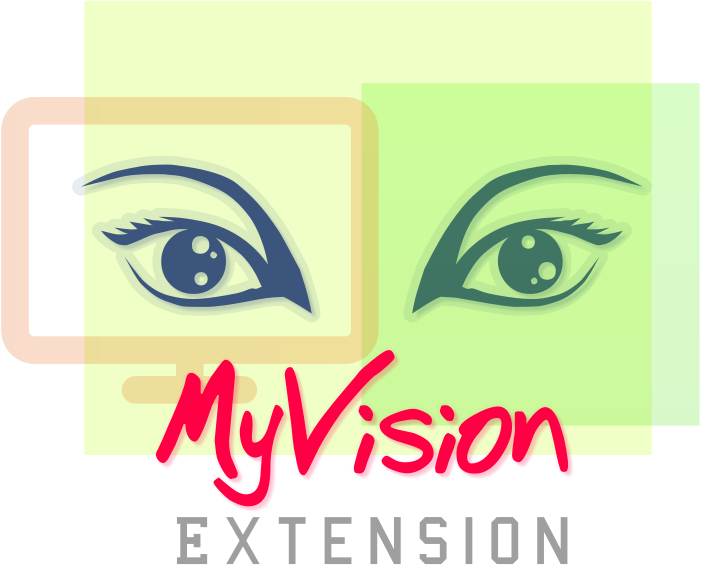
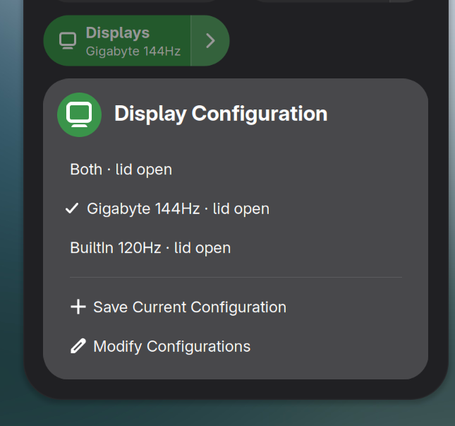
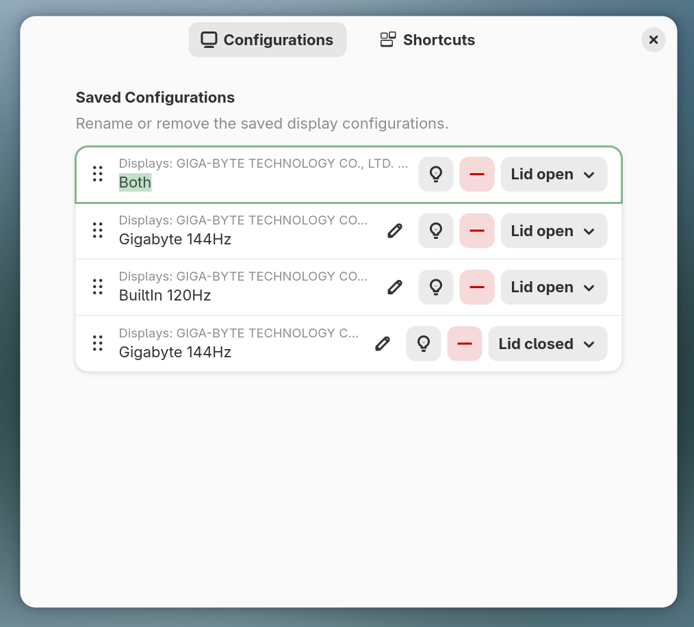

# My Vision

An improved fork of Display Configuration Switcher for GNOME Shell. Save and
switch display profiles from Quick Settings, with profiles bound to physical
monitor identities and laptop lid conditions.

<div align="center">
    
    <br>
    
    
</div>

## Features

- Save and restore display configurations with a single click
- Native GNOME OSD with the profile name on the displays enabled by a confirmed switch
- Keyboard shortcuts support for fast profile switching
- Profiles are bound to physical monitor identities (not port order)
- Drag & drop reordering of saved configurations
- Quick access from the GNOME Quick Settings menu

## Requirements

Declared GNOME Shell versions: **46–50**, as listed in `metadata.json`.

Build tools: Bash, Python 3, Node.js (syntax checks), zip, `blueprint-compiler`,
`glib-compile-schemas`, `glib-compile-resources` and `xmllint`.
Local installation also requires `gnome-extensions`.
The project provides a development environment in `shell.nix`:

```bash
nix-shell shell.nix
```

## Installation

Install from [GNOME Extensions](https://extensions.gnome.org/extension/9014/my-vision/),
or build and install from the project directory:

```bash
./build.sh --install
```

On Wayland, log out and back in when needed to load new or changed JavaScript,
then enable the extension:

```bash
gnome-extensions enable my-vision@digitalspace.name
```

Installation updates the user copy without enabling the extension or logging you out.

## Usage

1. Open the display profile menu in GNOME Quick Settings.
2. Save the current display configuration with a custom name.
3. Switch between saved profiles with a click or a configured keyboard shortcut.
4. Rename, reorder or remove profiles in Preferences:

```bash
gnome-extensions prefs my-vision@digitalspace.name
```

### Profile identity and laptop lids

New profiles remember the lid state in which they were saved. Preferences lets you
choose **Lid open**, **Lid closed**, or **Any lid state** for each profile. Profiles
that activate the built-in panel are unavailable with the lid closed. The built-in
panel is identified by Mutter's `is-builtin` property, not a hard-coded port name.

Availability requires the exact set of connected physical monitors as well as
an applicable lid condition. Connected monitors that the profile turns off still
belong to this set. A BuiltIn-only profile saved without an external monitor is
therefore separate from one saved with an external monitor attached; only the
profile for the current set appears in the menu, keyboard cycle, and automatic
restoration. Another monitor with the same model but a different identity does
not satisfy the saved context. All saved profiles remain accessible in preferences.

Duplicate detection compares the lid condition, physical monitor identities,
active monitor assignments, resolution/refresh/VRR mode, position, scale, rotation,
primary monitor and all stored properties. Connector renumbering, enumeration
order and dictionary ordering do not create duplicates. Saving an exact duplicate
keeps the existing profile and name. Different refresh rates or lid conditions
remain separate profiles.

Hardware is matched by vendor, product and serial information supplied by Mutter.
Legacy names are upgraded only when there is one unambiguous match. Identical
monitors without distinct identification are refused rather than assigned randomly.
Names from old profiles can still depend on the original desktop language until
upgraded; newly identified hardware does not.

The versioned `profiles-v2` setting stores stable profile IDs, lid conditions and
last selections per connected monitor set and lid state. On first use, existing
profiles are copied with **Any lid state** because their historical lid state is
unknown. The old `configs` and `last-config-index` keys remain untouched as a backup.
Renaming/reordering profiles does not change remembered selections. Deleting a
profile removes references to its ID. Changing a lid condition is refused if it
would introduce an exact duplicate.

## Development

```bash
./build.sh --check
./build.sh
```

The output is `dist/my-vision@digitalspace.name.zip`. `-b` and `-r` are build aliases;
`-i`, `-bi` and `-ri` build the current sources and install them. The script never
logs out the session automatically.

Blueprint UI files and GResource are compiled in a temporary directory. Only the
resource bundle, JavaScript modules, metadata and XML schema are packaged;
Blueprint sources, build scripts and development files stay outside the ZIP.

Compare with a separately saved previous distribution archive, if available:

```bash
./build.sh --compare-zip /path/to/previous-my-vision.zip
```

This verifies identical paths and bytes for all packaged files, including metadata
and the GResource bundle. ZIP timestamps and compression may differ.

### Startup behavior and verification

The last selection for the current monitor set and lid state is restored after
GNOME Shell finishes startup, and after the lid state or connected monitor set
changes. Without a remembered selection, a matching lid-specific profile is
preferred, followed by a usable legacy/shared profile. Display changes are
coalesced for 500 ms. Own mode-setting events do not repeatedly restore a profile.

Before applying, the extension refreshes the lid and monitor state, remaps ports
against that fresh state and verifies the saved mode/scale/color mode. It skips
ApplyMonitorsConfig when the requested settings already hold. A context change
supersedes the old request; transient stale-state retries are bounded. Manual
selections made during an apply are queued, with the latest selection taking priority.
No missing mode is silently replaced with a lower refresh rate. If no profile is
usable, the menu asks you to save one; the extension cannot invent your preferences.

Run regression checks without changing the running desktop:

```bash
glib-compile-schemas --strict schemas
GSETTINGS_BACKEND=memory gjs -m tests/profiles.js
gjs -m tests/display-config.js
gjs -m tests/initialization.js
node --test tests/startup.cjs tests/restore.cjs
```

An optional integration check reads the live lid/monitor state and checks legacy
profiles without applying a configuration or writing settings:

```bash
gjs -m tests/live-read-only.js
```

After installing an update, log out and back in so GNOME Shell loads the new
JavaScript modules and settings schema. Physical checks: save different external
monitor profiles with the lid open/closed; repeat saving to check deduplication;
verify 60 Hz and 144 Hz variants remain distinct; open/close the lid, reconnect the
dock, reorder/rename profiles and confirm the correct selection and refresh rate.
Also test rapid lid changes and disabling the extension during a switch.

## Troubleshooting

Use the development environment above if Blueprint or GLib build tools are missing.
After installing changed JavaScript, start a fresh GNOME session.

If a profile is unavailable, check that the connected monitor set and lid state
match its saved context. Ambiguous monitor identities are deliberately refused.
Report problems in the [issue tracker](https://github.com/tomasmark79/my-vision/issues)
with reproduction steps and the GNOME Shell version.

## License

[GPL-3.0-or-later](LICENSE). Copyright © 2024 Tomáš Mark.

Maintainer: [Tomáš Mark](https://github.com/tomasmark79).
Original author: **Christophe Van den Abbeele** (Display Configuration Switcher).

[GitHub](https://github.com/tomasmark79/my-vision) · [Donate via PayPal](https://paypal.me/TomasMark)
